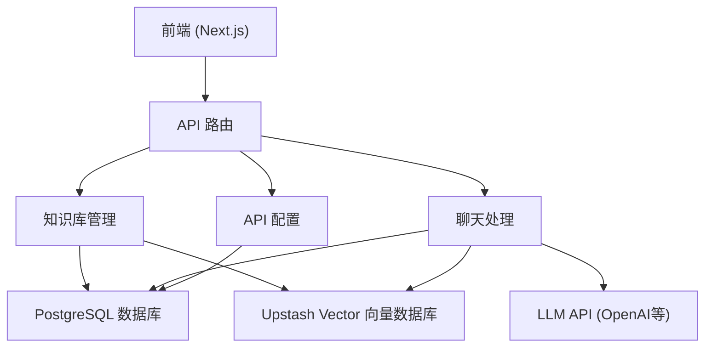

# RAG Chat 应用 Docker 部署指南

## 快速开始

### 1. 克隆项目
\`\`\`bash
git clone <repository-url>
cd rag-chat-app
\`\`\`

### 2. 配置环境变量
\`\`\`bash
cp .env.example .env
# 编辑 .env 文件，配置必要的环境变量
\`\`\`

### 3. 启动应用
\`\`\`bash
# 生产环境
chmod +x scripts/deploy.sh
./scripts/deploy.sh

# 或者手动启动
docker-compose up -d
\`\`\`

### 4. 访问应用
- 应用地址: http://localhost:3000
- 数据库: localhost:5432
- Redis: localhost:6379

## 开发环境

### 启动开发环境
\`\`\`bash
chmod +x scripts/dev.sh
./scripts/dev.sh

# 或者手动启动
docker-compose -f docker-compose.dev.yml up -d
\`\`\`

### 开发环境地址
- 应用地址: http://localhost:3001
- 数据库: localhost:5433
- Redis: localhost:6380

## 服务管理

### 查看服务状态
\`\`\`bash
docker-compose ps
\`\`\`

### 查看日志
\`\`\`bash
# 查看所有服务日志
docker-compose logs

# 查看特定服务日志
docker-compose logs app
docker-compose logs postgres
\`\`\`

### 停止服务
\`\`\`bash
docker-compose down
\`\`\`

### 重启服务
\`\`\`bash
docker-compose restart
\`\`\`

## 数据管理

### 备份数据
\`\`\`bash
chmod +x scripts/backup.sh
./scripts/backup.sh
\`\`\`

### 恢复数据
\`\`\`bash
# 从备份文件恢复
gunzip backups/rag_chat_backup_YYYYMMDD_HHMMSS.sql.gz
docker-compose exec -T postgres psql -U postgres rag_chat < backups/rag_chat_backup_YYYYMMDD_HHMMSS.sql
\`\`\`

### 数据库迁移
\`\`\`bash
docker-compose exec app npx drizzle-kit push:pg
\`\`\`

## 监控

### 启动监控服务
\`\`\`bash
docker-compose -f docker-compose.yml -f docker-compose.monitoring.yml up -d
\`\`\`

### 访问监控界面
- Prometheus: http://localhost:9090
- Grafana: http://localhost:3001 (admin/admin)

## 故障排除

### 常见问题

1. **端口冲突**
   - 修改 .env 文件中的端口配置
   - 或停止占用端口的其他服务

2. **数据库连接失败**
   - 检查 PostgreSQL 容器是否正常运行
   - 验证数据库连接字符串

3. **应用无法启动**
   - 检查环境变量配置
   - 查看应用日志: `docker-compose logs app`

4. **文件上传失败**
   - 检查上传目录权限
   - 确认文件大小限制

### 重置环境
\`\`\`bash
# 停止所有服务
docker-compose down

# 删除所有数据卷（注意：这会删除所有数据）
docker-compose down -v

# 重新启动
docker-compose up -d
\`\`\`

## 生产环境建议

1. **安全配置**
   - 修改默认密码
   - 配置防火墙规则
   - 使用HTTPS

2. **性能优化**
   - 配置适当的资源限制
   - 启用日志轮转
   - 配置缓存策略

3. **备份策略**
   - 定期自动备份
   - 异地备份存储
   - 测试恢复流程

4. **监控告警**
   - 配置健康检查
   - 设置监控告警
   - 日志聚合分析
=======
### RAG Chat 应用项目文档

## 1. 项目概述

RAG Chat 是一个基于检索增强生成（Retrieval Augmented Generation）技术的聊天应用，允许用户上传和管理知识库，并基于这些知识进行智能对话。应用支持多种API配置，历史记录持久化，以及思考过程的可视化。

### 核心价值

- **知识库增强对话**：利用用户上传的文档作为上下文，提供更准确的回答
- **透明的信息来源**：清晰显示回答来自哪些文档，增强可信度
- **灵活的API配置**：支持多种LLM、Embedding和重排模型
- **简洁直观的界面**：专注于内容而非装饰元素


## 2. 系统架构



### 主要组件

1. **前端界面**：基于Next.js和React构建的用户界面
2. **API路由**：处理前端请求的服务器端API
3. **知识库管理**：处理文档上传、分块和向量化
4. **聊天处理**：管理对话流程和RAG检索
5. **API配置**：管理不同模型的API设置
6. **数据存储**：

1. PostgreSQL：存储用户数据、聊天历史和配置
2. Upstash Vector：存储文档向量用于语义搜索


## 3. 功能特性

### 知识库管理

- **文档上传**：支持多种格式文档（TXT、MD、PDF、DOC、DOCX）
- **自动分块**：将文档内容分割成适合向量化的小块
- **向量索引**：使用Upstash Vector存储和检索文档向量
- **知识库展示**：可视化管理已上传的文档
- **文档删除**：支持删除不需要的知识库条目


### 聊天功能

- **RAG检索**：基于用户问题检索相关知识
- **来源显示**：在回答中显示信息来源
- **流式输出**：实时显示AI回复
- **思考过程**：可选显示AI的推理过程
- **会话管理**：支持多个聊天会话
- **历史记录**：持久化存储对话历史


### API配置

- **多模型支持**：配置不同的LLM、Embedding和重排模型
- **OpenAI兼容**：支持OpenAI格式的API
- **自定义端点**：支持自定义API端点和密钥
- **动态切换**：可以动态激活/停用不同配置


## 4. 技术栈

### 前端

- **Next.js 15**：React框架，支持服务器组件和API路由
- **React**：用户界面库
- **Tailwind CSS**：实用优先的CSS框架
- **shadcn/ui**：基于Radix UI的组件库
- **Lucide React**：图标库


### 后端

- **Next.js API Routes**：处理API请求
- **Drizzle ORM**：TypeScript优先的ORM
- **PostgreSQL**：关系型数据库
- **Upstash Vector**：向量数据库
- **Vercel AI SDK**：AI模型集成工具


### AI集成

- **OpenAI兼容API**：支持各种LLM模型
- **向量嵌入**：文档和查询的向量表示
- **流式输出**：实时生成和显示回答


## 5. 安装和配置指南

### 前提条件

- Node.js 18+
- PostgreSQL数据库
- Upstash Vector账户
- OpenAI API密钥或兼容的替代品


### 安装步骤

1. **克隆代码库**


```shellscript
git clone https://github.com/yourusername/rag-chat-app.git
cd rag-chat-app
```

2. **安装依赖**


```shellscript
npm install
# 或
yarn install
# 或
pnpm install
```

3. **环境变量配置**


创建`.env.local`文件并添加以下变量：

```plaintext
DATABASE_URL=your_postgres_connection_string
UPSTASH_VECTOR_REST_URL=your_upstash_vector_url
UPSTASH_VECTOR_REST_TOKEN=your_upstash_vector_token
NEXT_PUBLIC_BASE_URL=http://localhost:3000
```

4. **数据库迁移**


```shellscript
npx drizzle-kit push:pg
```

5. **启动开发服务器**


```shellscript
npm run dev
# 或
yarn dev
# 或
pnpm dev
```

6. **访问应用**


打开浏览器访问 `http://localhost:3000`

### 部署到生产环境

1. **构建应用**


```shellscript
npm run build
# 或
yarn build
# 或
pnpm build
```

2. **启动生产服务器**


```shellscript
npm start
# 或
yarn start
# 或
pnpm start
```

3. **使用Vercel部署**


```shellscript
vercel
```

## 6. API文档

### 知识库管理API

#### 获取所有知识库条目

```plaintext
GET /api/knowledge-base
```

**响应**：

```json
[
  {
    "id": "uuid",
    "name": "文档名称",
    "description": "文档描述",
    "fileName": "file.txt",
    "fileSize": 1024,
    "createdAt": "2023-01-01T00:00:00Z"
  }
]
```

#### 上传新文档

```plaintext
POST /api/knowledge-base
Content-Type: multipart/form-data
```

**请求体**：

- `file`: 文件
- `name`: 文档名称
- `description`: 文档描述（可选）


**响应**：

```json
{
  "id": "uuid",
  "name": "文档名称",
  "description": "文档描述",
  "fileName": "file.txt",
  "fileSize": 1024,
  "createdAt": "2023-01-01T00:00:00Z"
}
```

#### 删除文档

```plaintext
DELETE /api/knowledge-base?id=uuid
```

**响应**：

```json
{
  "success": true
}
```

### 聊天API

#### 发送消息

```plaintext
POST /api/chat
Content-Type: application/json
```

**请求体**：

```json
{
  "messages": [
    {
      "role": "user",
      "content": "用户消息"
    }
  ],
  "sessionId": "uuid"
}
```

**响应**：
流式响应，包含AI回复和来源信息

### API配置API

#### 获取所有配置

```plaintext
GET /api/configs
```

**响应**：

```json
[
  {
    "id": "uuid",
    "name": "配置名称",
    "type": "llm",
    "provider": "openai",
    "model": "gpt-4",
    "isActive": true
  }
]
```

#### 创建新配置

```plaintext
POST /api/configs
Content-Type: application/json
```

**请求体**：

```json
{
  "name": "配置名称",
  "type": "llm",
  "provider": "openai",
  "model": "gpt-4",
  "apiKey": "sk-...",
  "baseUrl": "https://api.openai.com",
  "isActive": true
}
```

**响应**：

```json
{
  "id": "uuid",
  "name": "配置名称",
  "type": "llm",
  "provider": "openai",
  "model": "gpt-4",
  "isActive": true
}
```

## 7. 使用指南

### 知识库管理

1. **上传文档**

1. 导航到"Knowledge Base"页面
2. 填写文档名称和描述
3. 选择要上传的文件
4. 点击"Upload Document"按钮


2. **查看和删除文档**

1. 在"Knowledge Base"页面右侧查看已上传的文档
2. 点击文档旁边的删除图标删除文档


### API配置

1. **添加新配置**

1. 导航到"Settings"页面
2. 点击"Add Configuration"按钮
3. 填写配置信息
4. 点击"Save Configuration"按钮


2. **激活配置**

1. 在配置卡片上切换开关以激活/停用配置
2. 每种类型只能有一个激活的配置


### 聊天功能

1. **创建新对话**

1. 点击侧边栏中的"New Chat"按钮
2. 开始输入问题


2. **查看历史对话**

1. 在侧边栏中选择历史对话


3. **查看思考过程**

1. 点击右上角的"Show Reasoning"按钮
2. 在消息中展开"Reasoning Process"查看详细推理


4. **查看信息来源**

1. 在AI回复下方查看"Sources"部分，显示信息来源的文档


## 8. 开发指南

### 项目结构

```plaintext
rag-chat-app/
├── app/                  # Next.js App Router
│   ├── api/              # API路由
│   ├── knowledge/        # 知识库管理页面
│   ├── settings/         # API配置页面
│   ├── page.tsx          # 主聊天页面
│   └── layout.tsx        # 应用布局
├── components/           # React组件
│   └── ui/               # UI组件
├── lib/                  # 工具库
│   ├── db/               # 数据库相关
│   └── vector/           # 向量数据库相关
├── public/               # 静态资源
└── package.json          # 项目依赖
```

### 扩展指南

#### 添加新的模型提供商

1. 修改`app/api/chat/route.ts`中的模型配置部分：


```typescript
// 添加新的模型提供商
if (llmConfig.provider === "openai") {
  model = openai(llmConfig.model, {
    apiKey: llmConfig.apiKey,
    baseURL: llmConfig.baseUrl,
  })
} else if (llmConfig.provider === "newprovider") {
  // 配置新的提供商
  model = newprovider(llmConfig.model, {
    apiKey: llmConfig.apiKey,
    baseURL: llmConfig.baseUrl,
  })
} else {
  // 默认配置
  model = openai(llmConfig.model, {
    apiKey: llmConfig.apiKey,
    baseURL: llmConfig.baseUrl,
  })
}
```

2. 在`app/settings/page.tsx`中添加新的提供商选项：


```typescript
<SelectContent>
  <SelectItem value="openai">OpenAI</SelectItem>
  <SelectItem value="anthropic">Anthropic</SelectItem>
  <SelectItem value="newprovider">New Provider</SelectItem>
  <SelectItem value="custom">Custom</SelectItem>
</SelectContent>
```

#### 添加新的文档处理方式

1. 修改`lib/vector/index.ts`中的分块函数：


```typescript
export function generateChunks(input: string): string[] {
  // 添加新的分块逻辑
  if (someCondition) {
    return customChunkingLogic(input);
  }
  
  // 默认分块逻辑
  return input
    .trim()
    .split(/[.!?]+/)
    .filter((chunk) => chunk.trim().length > 0)
    .map((chunk) => chunk.trim())
}
```

## 9. 常见问题

### Q: 支持哪些文件格式？

**A**: 目前支持TXT、MD、PDF、DOC和DOCX格式。对于PDF、DOC和DOCX格式，需要额外的解析库。

### Q: 如何更改向量数据库？

**A**: 修改`lib/vector/index.ts`文件，替换Upstash Vector相关代码为新的向量数据库实现。

### Q: 如何调整RAG检索的相关性？

**A**: 在`lib/vector/index.ts`的`findRelevantContent`函数中调整`topK`参数。

### Q: 如何备份知识库数据？

**A**: 知识库数据存储在PostgreSQL和Upstash Vector中。定期备份PostgreSQL数据库，并考虑导出Upstash Vector中的向量数据。

### Q: 应用支持多用户吗？

**A**: 当前版本不支持多用户认证。可以通过添加认证系统（如NextAuth.js）来实现多用户支持。

### Q: 如何提高RAG的准确性？

**A**: 考虑以下方法：

- 优化文档分块策略
- 添加重排模型
- 使用更高质量的嵌入模型
- 实现混合搜索（关键词+语义）


## 10. 贡献指南

### 提交问题

如果您发现任何问题或有功能请求，请在GitHub仓库中创建一个issue，包含以下信息：

- 问题描述
- 复现步骤
- 预期行为
- 实际行为
- 环境信息


### 提交代码

1. Fork仓库
2. 创建功能分支 (`git checkout -b feature/amazing-feature`)
3. 提交更改 (`git commit -m 'Add some amazing feature'`)
4. 推送到分支 (`git push origin feature/amazing-feature`)
5. 创建Pull Request


---

## 许可证

本项目采用MIT许可证 - 详情请参阅LICENSE文件

---

*文档最后更新: 2025年6月3日*

This generation may require the following integrations:
